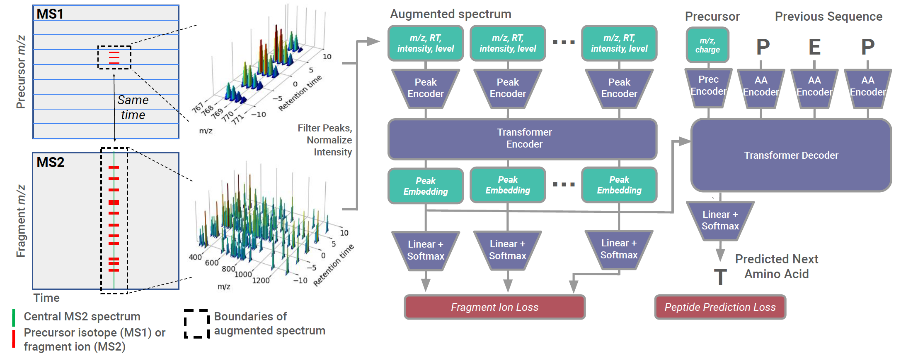

Cascadia
===================================

**A transformer model for de novo sequencing of data-independent acquisition mass spectrometry data**

Contents
-----------------------------------

.. toctree::
    Getting Started <getting_started.md>
    File Formats <file_formats.md>
    Usage <usage.md>
    FAQs <faqs.md>

If you use Casanovo in your work, please cite the following publication:

Sanders, Justin, et al. ‘A Transformer Model for de Novo Sequencing of Data-Independent Acquisition Mass Spectrometry Data’. bioRxiv, Cold Spring Harbor Laboratory, 2024, https://doi.org/10.1101/2024.06.03.597251.
